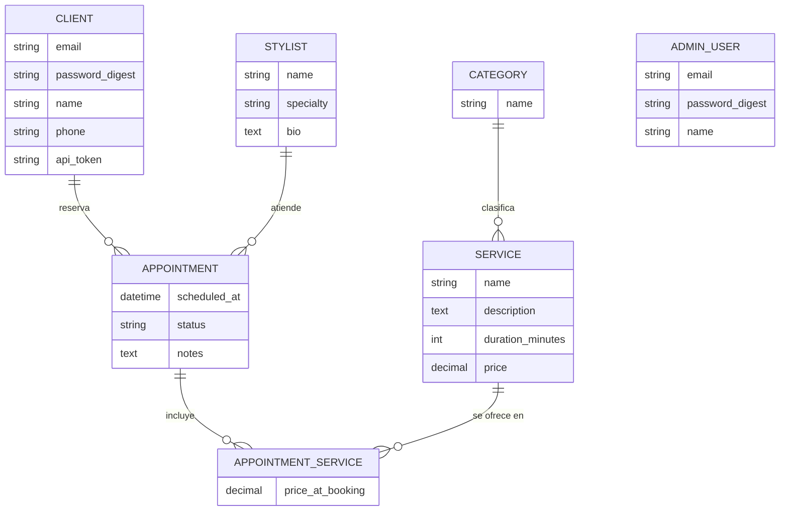

# Definición del proyecto — TP1 Programación IV

## Temática

Sistema de gestión de turnos para una peluquería / centro de estética.

## Objetivo general

Permitir que los clientes reserven turnos online para servicios específicos (corte, color, manicura, etc.) con un estilista determinado, y que el personal del local administre estilistas, servicios y la agenda de turnos desde un back-office.

## Tipos de usuario

| Usuario | Descripción | Autenticación |
|---|---|---|
| **Administrador** (`AdminUser`) | Personal del local. Accede al back-office para gestionar estilistas, servicios, categorías y turnos. | Sesión tradicional de Rails (`has_secure_password`). |
| **Cliente** (`Client`) | Usuario final. Consume la API pública/protegida para ver estilistas y servicios disponibles, y reservar/consultar sus propios turnos. | Login contra la API (usuario/contraseña) que devuelve un token, usado en requests posteriores. |

El estilista (`Stylist`) es una entidad de negocio administrada por el back-office; no inicia sesión en el sistema.

## Entidades principales y relaciones

- **AdminUser**: personal con acceso al back-office.
- **Client**: cliente final que reserva turnos.
- **Stylist**: profesional que atiende los turnos (nombre, especialidad, foto de perfil).
- **Category**: categoría de servicios (ej. "Cabello", "Uñas", "Piel").
- **Service**: servicio ofrecido (nombre, duración, precio), pertenece a una categoría.
- **Appointment**: turno reservado por un cliente con un estilista, en una fecha/hora determinada.
- **AppointmentService**: detalle de los servicios incluidos en un turno (permite reservar más de un servicio por turno y conserva el precio pactado al momento de la reserva).

### Relaciones

- Un `Client` puede tener muchos `Appointment` (reserva).
- Un `Stylist` puede tener muchos `Appointment` (atiende).
- Un `Appointment` puede incluir muchos `Service`, a través de `AppointmentService`.
- Una `Category` puede tener muchos `Service` (clasifica).

### Diagrama

## Funcionalidades principales previstas

- Back-office (`/admin`) protegido por autenticación: CRUD de estilistas, categorías, servicios y turnos.
- API (`/api/v1`): login de clientes con token, listado público de estilistas y servicios, reserva y consulta de turnos propios.
- Active Storage: foto de perfil del estilista.
- Action Mailer: email de confirmación al cliente cuando se crea un turno.
- Validación de negocio: un estilista no puede tener dos turnos superpuestos en el mismo horario.
